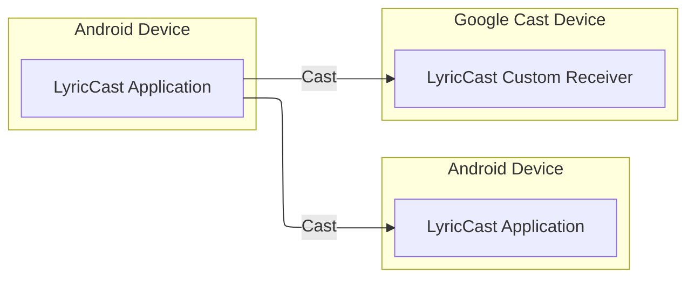

# LyricCast

*LyricCast* is an Android application that allows you to cast lyrics to your TV screen using Google
Cast.
The main audience for the app is churches, where the lyrics are projected on the screen during the
service.
Current solutions require proprietary hardware and software which are expensive and often slow
responding.
*LyricCast* aims to provide a simple and affordable solution for churches and other organizations
that need to cast
lyrics
to a TV screen using off the shelf devices.
*LyricCast* is localized in English and Polish.

# Overview

*LyricCast* application consists of the following elements:

* [Android client app](android)
* [Google Cast custom receiver app and privacy policy](js)

> [!NOTE]
> Each element is described in a separate ReadMe document.

# Architecture

*LyricCast* consists of a client app and a Google Cast custom receiver app.
This section outlines the architecture of the *LyricCast* ecosystem.

## Repository structure

The app project is modularized to separate concerns and make the codebase more maintainable.

This project consists of modules:

* android - contains the Android client app
* js/iac - contains the AWS CDK infrastructure as code
* js/google-cast-custom-receiver-app - contains the Google Cast custom receiver app
* js/privacy-policy - contains the privacy policy page

## Architecture components

This section presents simplified architecture components of the *LyricCast* ecosystem.

