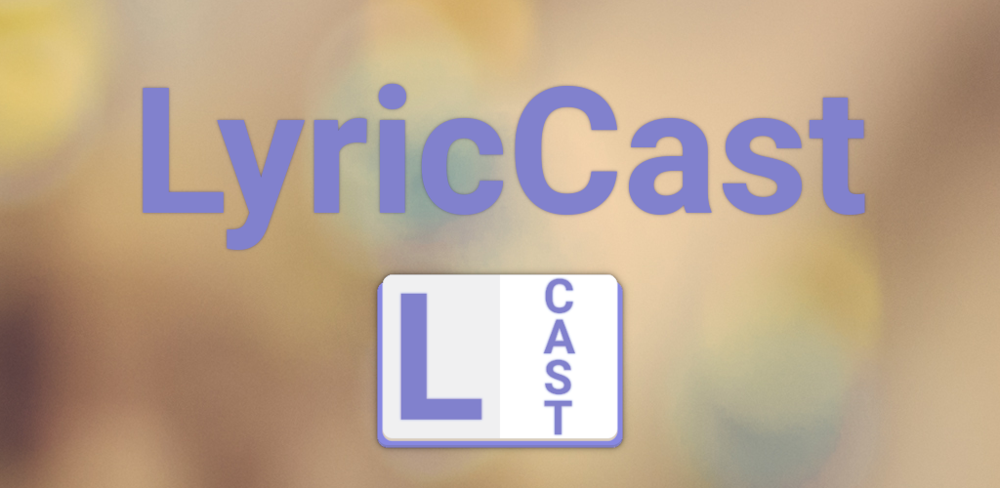

[//]: # (TODO: add link after the app is publicly released)

> [!NOTE]
> LyricCast is undergoing closed testing on Google Play. Public access is coming soon!

# LyricCast

*LyricCast* is an Android application that allows you to cast lyrics to your TV screen using Google Cast.
The main audience for the app is churches, where the lyrics are projected on the screen during the service.
Current solutions require proprietary hardware and software which are expensive and often slow responding.
*LyricCast* aims to provide a simple and affordable solution for churches and other organizations that need to cast
lyrics
to a TV screen using off the shelf devices.
*LyricCast* is localized in English and Polish.

# Features

## Song lyrics database

*LyricCast* allows you to create an on-device database of song lyrics and setlists.
The app supports importing and exporting the full or parts of the database to and from a file.
MongoDB Realm is used as a database to store the data on-device.

### Categories

The app lets you create categories which are used to organize songs.
Category manager is accessible through the action menu on the main screen.
You can name the category and set a color for easier identification.
Category name must be unique.

### Songs

The app includes a song editor that allows you to create and edit songs.
The song editor allows you to set the song title, assign a category, and add lyrics.
Lyrics are split in sections which can be then shown on the screen one after another.
Song title must be unique.

### Setlists

Songs can be grouped into a setlist.
A setlist can be created using the floating action button on the main screen or by selecting multiple song and creating
an 'ad-hoc' setlist.
The setlist editor allows you to set the setlist name and add songs.
Songs can be reordered by dragging them using the handle on the right side.
You can also duplicate songs withing the setlist by long pressing the song and selecting 'Duplicate' in the action menu.
Setlist name must be unique.

### Import/Export

To ease up the process of creating and managing the database, the app supports importing and exporting the full or parts
of the database to and from a file.
The app supports its own JSON based file format and [OpenSong](https://opensong.org/development/file-formats/) to allow
the users to import their existing databases.
You can instruct the app to replace your current database on import or replace song lyrics and setlists on conflict.
The default import behavior is to ignore conflicts and import only new songs and setlists.

## Cast lyrics using Google Cast.

*LyricCast* allows you to cast lyrics to your TV screen using Google Cast.
The functionality is accessible through the ubiquitous Cast button in the app bar.
Song lyrics will be cast after selecting a songs or setlist on the main screen.
You can blank the screen from the song/setlist controls if need be.

The cast lyrics will be automatically resized to fit the screen with a maximum font size set in the settings.

## [WIP] Start a session and let others join in.

*Coming soon* - *LyricCast* will allow you to start a session and let others join in.
When joining a session you will see the lyrics that are currently being cast by the session host.

## Settings

*LyricCast* allows you to customize the app through the settings screen.
The settings screen consists of multiple sections.

### Application

In this section you can change the following settings:

- Theme - choose between light, dark or system default theme.
- Controls button height - set the height of the controls buttons. This option is useful if you need to be able to
  quickly tap the buttons and don't miss.

### Chromecast

In this section you can change the following settings:

- Blanked on start - when casting lyrics, the screen will be initially blanked.
  The blank is applied after successfully connecting to the cast device.
- Background color - the background color of the cast lyrics screen.
- Font color - the font color of the cast lyrics screen.
- Maximum font size - the maximum font size of the cast lyrics screen.

# Development Environment

**LyricCast** uses the Gradle build system and can be imported directly into Android Studio
(make sure you are using the latest stable version available [here](https://developer.android.com/studio)).

Change the run configuration to `app`.

The `debug` and `release` build variants can be built and run.

# Architecture

*LyricCast* is designed to work entirely on-device.
That being said any external library that requires internet connection might send data to the internet (i.e. `Firebase`,
`Google Cast SDK`).

## Project structure

The app project is modularized to separate concerns and make the codebase more maintainable.

This project consists of modules:

* app - LyricCast app:
    * application - application related classes.
    * di - dependency injection related classes.
    * domain - domain specific classes.
    * shared - extensions, google cast, etc.
    * ui - view segregated by features (feature based structure)
* common - it's in the name.
* dataModel - repositories, data structures
* dataTransfer - format converters (app-json, app-xml, etc)

## Architecture components

# Build

The app contains the usual `debug` and `release` build variants.

For development use the `debug` variant. For UI performance testing use the `release` variant.

# Testing

To facilitate testing of components, **LyricCast** uses dependency injection with
[Hilt](https://developer.android.com/training/dependency-injection/hilt-android).

Most data layer components are defined as interfaces.
Then, concrete implementations (with various dependencies) are bound to provide those interfaces to
other components in the app.
In tests, **LyricCast** notably does _not_ use any mocking libraries.
Instead, the production implementations can be replaced with test doubles using Hilt's testing APIs
(or via manual constructor injection for `ViewModel` tests).

These test doubles implement the same interface as the production implementations and generally
provide a simplified implementation with additional testing hooks.

Examples:

- In instrumentation tests, `MutableList` based repository implementations are used instead of the standard MongoDB
  Realm one.

Following projects contain tests:

- `app` - a set of instrumented tests
- `common` - a set of unit tests

To run the tests go to the corresponding module and run the whole test directory or selected tests using the IDE.

# UI

The app was designed using [Material 3 guidelines](https://m3.material.io/).

The app has two themes:

- Dynamic color - uses colors based on
  the [user's current color theme](https://material.io/blog/announcing-material-you) (if supported)
- Default theme - uses predefined colors when dynamic color is not supported

Each theme also supports dark mode.
