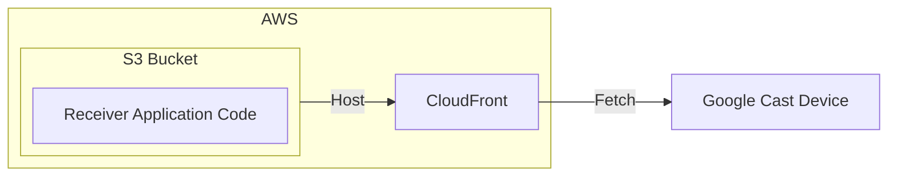

# LyricCast JavaScript

This is the JavaScript part of the *LyricCast* app.

# Architecture

This section outlines the architecture of the *LyricCast* JavaScript part.

## Project structure

[//]: # (TODO: Update after adding the privacy policy page)

This project consists of modules:

- `iac` - contains the AWS CDK infrastructure as code
- `google-cast-custom-receiver-app` - contains the Google Cast custom receiver app
- `eslint-config` - contains the shareable ESLint configuration

## Architecture components

This section presents components of the *LyricCast* JavaScript part.

### Custom Receiver Application Infrastructure

